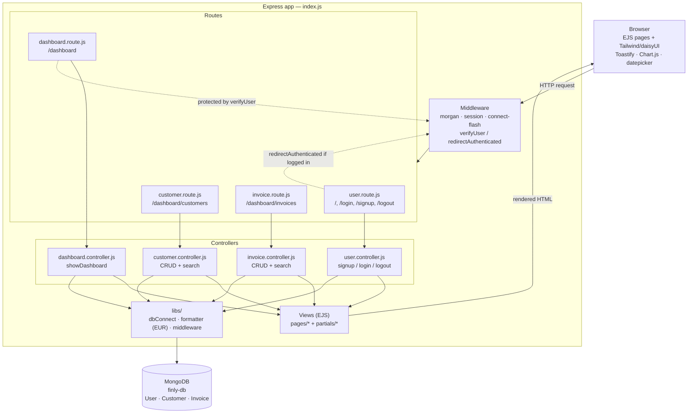
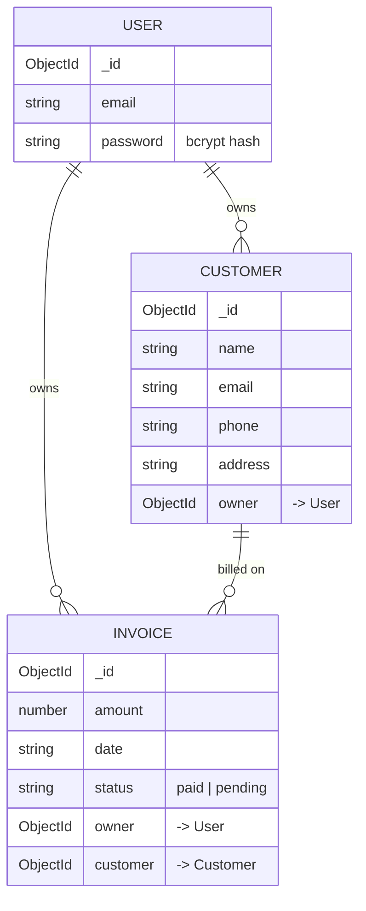

# Finly

A customer and invoice tracking app.

Live demo: https://finly-c7p0.onrender.com/

Finly lets a signed-in user manage a private book of customers and invoices, and view a dashboard summarizing revenue, outstanding balances, and recent activity.

## Features

- **Auth** — email/password signup & login, sessions, password hashing (bcrypt)
- **Dashboard** — total collected / pending amounts, invoice & customer counts, a 6‑month revenue chart, and the 5 most recent invoices
- **Customers** — create, search, edit, delete
- **Invoices** — create, search, edit, delete; linked to a customer and a status (`paid` / `pending`)
- All data is scoped per signed-in user (`owner` field on each record)

## Tech stack

| Layer       | Choice |
|-------------|--------|
| Runtime     | Node.js |
| Web framework | Express 5 |
| Views       | EJS (server-rendered) + partials |
| Styling     | Tailwind CSS v4 + daisyUI |
| Database    | MongoDB via Mongoose |
| Auth/session | `express-session` + `bcrypt` |
| Validation  | `express-validator` |
| Flash messages | `connect-flash` (rendered as Toastify toasts) |
| Charts      | Chart.js (dashboard revenue chart, client-side) |
| Logging     | Morgan |

## Architecture

Finly is a classic server-rendered MVC-style app: Express routes delegate to controllers, controllers talk to Mongoose models, and controllers render EJS views back to the browser. There is no API/SPA layer — every page is rendered on the server and forms post back to Express routes.



### Request flow

1. **`index.js`** boots Express, loads env vars (`dotenv`), connects to MongoDB (`libs/dbConnect.js`), and wires up global middleware: `morgan` (logging), `express-session` (auth state), `connect-flash` (one-shot UI messages), and static file serving from `public/`.
2. **Routing** is split by feature:
   - `routes/user.route.js` — public auth routes (`/`, `/login`, `/signup`, `/logout`), guarded by `redirectAuthenticated` so a logged-in user is bounced to `/dashboard`.
   - `routes/dashboard.route.js` — mounted at `/dashboard` behind `verifyUser` (redirects to `/login` if no session), and itself mounts `customer.route.js` and `invoice.route.js`.
3. **Controllers** validate input with `express-validator`, run the Mongoose query/mutation (scoped to `req.session.userId` as `owner`), set a flash message, and either `redirect` or `res.render` an EJS page.
4. **Views** (`views/pages/*.ejs`) compose shared `views/partials/*` (head, navbar, forms, script) and render server-side; the dashboard additionally hydrates a Chart.js chart client-side from JSON passed in by the controller, and flash messages are surfaced as Toastify toasts.
5. **Models** (`libs/models/*.js`) define three Mongoose schemas — `User`, `Customer`, `Invoice` — with `Customer` and `Invoice` each referencing their owning `User`, and `Invoice` also referencing a `Customer`.

## Data model



## Project structure

```
finly/
├─ index.js                  # App entry point: middleware, routing, server start
├─ controllers/               # Request handlers (business logic)
│  ├─ user.controller.js
│  ├─ dashboard.controller.js
│  ├─ customer.controller.js
│  └─ invoice.controller.js
├─ routes/                    # Express routers
│  ├─ user.route.js
│  ├─ dashboard.route.js
│  ├─ customer.route.js
│  └─ invoice.route.js
├─ libs/
│  ├─ dbConnect.js            # Mongoose connection
│  ├─ formatter.js            # EUR currency formatter
│  ├─ middleware.js           # verifyUser / redirectAuthenticated
│  └─ models/                 # Mongoose schemas (User, Customer, Invoice)
├─ views/
│  ├─ pages/                  # index, login, signup, dashboard, customers, invoices, 404
│  └─ partials/                # head, navbar, forms, script, shared table rows
├─ public/
│  ├─ css/                    # Tailwind input/output CSS
│  └─ images/
└─ tailwind.config.js
```

## Getting started

### Prerequisites

- Node.js
- A MongoDB connection string (e.g. a free MongoDB Atlas cluster)

### Setup

```bash
npm install
```

Create a `.env` file in the project root:

```env
MONGODB_URI=<your MongoDB connection string>
SESSION_SECRET=<any random string>
```

Build the Tailwind CSS once (or run the watcher during development):

```bash
npm run tailwind:build   # one-off, minified
# or
npm run tailwind:dev     # watch mode
```

### Run

```bash
npm start        # node index.js
# or, with auto-restart + CSS watcher together
npm run dev
```

The app listens on **http://localhost:10000**.

## Scripts

| Script | Purpose |
|--------|---------|
| `npm start` | Run the server with `node` |
| `npm run server` | Run the server with `nodemon` (auto-restart) |
| `npm run tailwind:dev` | Watch and rebuild Tailwind CSS |
| `npm run tailwind:build` | Build minified Tailwind CSS |
| `npm run dev` | Run `server` and `tailwind:dev` concurrently |
